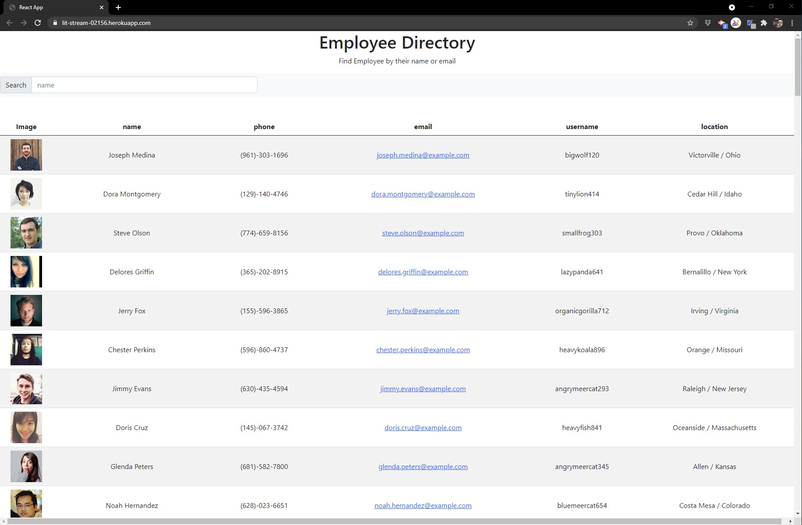

# Employee Directory React

  []

  Employee Tracker to provide quick access to retrieve employee information.

  ## Table of Contents
  * [Installation](#Installation)
  * [Usage](#Usage)
  * [License](#License)
  * [Contributing](#Contributing)
  * [Tests](#Tests)
  * [Questions](#Questions)

## Installation

Please follow these steps to ensure a proper installation. 
After forking the repo, you will need to run /npm install axios bootstrap/ once this is completed, then you will use npm start to launch the app.

## Usage

The following will outline the steps needed to use this project.  
Simply type in the name of the employee you wish to find. 

## License
The MIT License

Please follow the link to learn more about the License this project is protected under. 
[https://opensource.org/licenses/MIT](https://opensource.org/licenses/MIT)

## Contributing

How can you contribute? 
Provide feedback, I am still working on updating this repo to allow column sorting

## Tests

The following test steps can be taken to ensure the project is running correctly. 
Use it

## Questions

Please contact me with any questions about this project. 

My GitHub URL is [https://github.com/jmalm79](https://github.com/jmalm79)

Email: jmalm79@gmail.com

